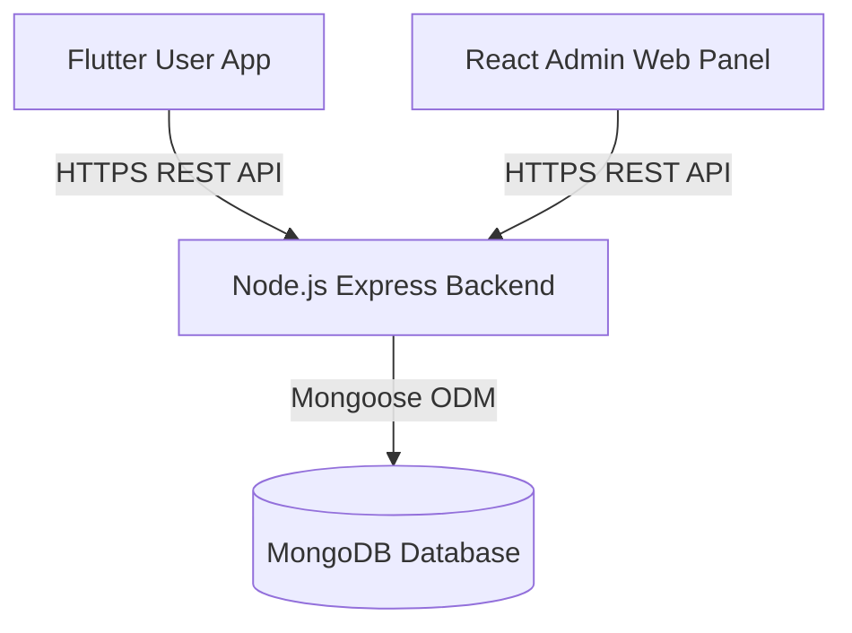
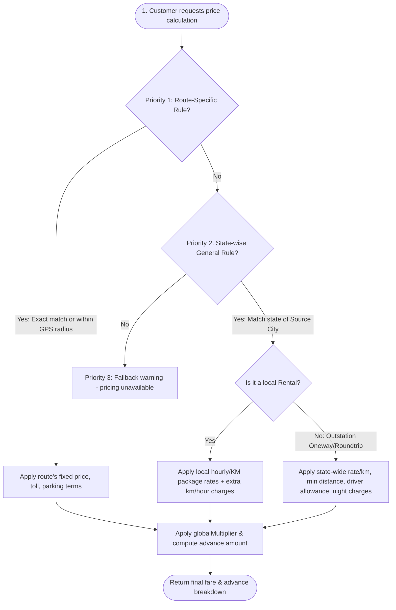

# Broom Boom Cabs — System Flow & Local Setup Guide

Welcome to the **Broom Boom Cabs** codebase! This document outlines the system architecture, core application flows, database schemas, and step-by-step instructions to run the entire application ecosystem locally.

---

## 1. System Architecture & Flow

The system consists of three main components:
1. **Backend (NodeJS/Express + MongoDB)**: The central business logic, pricing engine, database access layer, and booking manager.
2. **Admin Panel (React + Vite + TailwindCSS)**: The web interface used by admins to manage cities, vehicle types, bookings, users, and configure general or route-specific pricing.
3. **User App (Flutter)**: The mobile application used by customers to book cabs, check pricing, and review past bookings.

### System Diagram



---

## 2. Core Application Flows

### A. Customer Booking & Pricing Engine Flow
When a customer requests a ride on the mobile app, the system calculates pricing dynamically according to a set of prioritized rules:



#### Detailed Pricing Priorities:
1. **Priority 1: Route-Specific Pricing (`RoutePricing`)**
   - Looks for an exact text match for source and destination cities (e.g. `Kolkata Airport` to `Digha`).
   - If exact text is not matched, it uses the **Haversine formula** to check if the user's coordinates fall within the configured `nearbyRadiusKm` of a defined route rule.
   - If a rule is found, the system applies a **fixed price** and respects specific toggle overrides (include toll tax, parking, or night allowance).
2. **Priority 2: State-wise Fallback & Rental Packages (`StatePricing` & `RentalPackage`)**
   - Looks up the state corresponding to the source city.
   - **For Local Rentals**: Applies the selected package (e.g., *8 hrs / 80 kms*). If the booking exceeds these limits, it dynamically adds `extraKmRate` and `extraHourRate` charges.
   - **For Oneway/Roundtrip**: Applies the state's `ratePerKm`, matching the `seater` count and `acType`. It calculates distance-based fares, enforcing the state's minimum billing distance (`minKms`), driver allowance (`driverBata`), and night allowances if picking up during night hours (10:00 PM – 6:00 AM).
3. **Priority 3: Fallback Warning**
   - Returns a warning message that pricing is currently unavailable for the chosen location.

---

## 3. Database Entities Reference

Here are the key MongoDB collections used in the backend:

| Collection | Model Class | Key Fields | Description |
| :--- | :--- | :--- | :--- |
| **users** | `User` | `name`, `email`, `phone`, `status` (`Active`/`Suspended`) | Customer profiles registered on the app. |
| **carcategories** | `CarCategory` | `name`, `displayName`, `seater`, `baseFare`, `perKmRate` | Defines supported cab categories (Hatchback, Sedan, SUV, SUV+). |
| **cities** | `City` | `name`, `displayName`, `lat`, `lon`, `state`, `placeId` | Regulated cities used to lookup GPS coords & state attributes. |
| **statepricings** | `StatePricing` | `state`, `rideCategory`, `carCategory`, `ratePerKm`, `minKms`, `driverBata` | State-level default fallback pricing rules. |
| **routepricings** | `RoutePricing` | `pickupLocation`, `dropLocation`, `pickupLat`/`Lng`, `fixedPrice`, `nearbyRadiusKm` | Custom fixed-rate route rules with geofencing. |
| **rentalpackages** | `RentalPackage` | `state`, `carCategory`, `packageHours`, `includedKms`, `baseFare` | Hour/KM bundle offerings by state. |
| **globalsettings** | `GlobalSetting` | `key`, `value` | Global rules like `globalMultiplier` (used for surge pricing). |
| **bookings** | `Booking` | `bookingId`, `customerName`, `fare`, `advance`, `dueFare`, `status`, `driverName` | Customer bookings, payment details, and pilot allocations. |

---

## 4. How to Run the App Locally

### Prerequisites
Make sure you have the following installed on your machine:
- **Node.js** (v18 or higher recommended)
- **MongoDB** (Local Community Server running on `mongodb://localhost:27017` or a MongoDB Atlas URI)
- **Flutter SDK** (v3.7.0 or higher) + Android Studio/Xcode (for emulator/simulator)

---

### Step 1: Run the Backend

1. Navigate to the backend directory:
   ```bash
   cd "/Users/rhythm/Desktop/Broom Boom/broomboom_user_backend"
   ```
2. Install npm dependencies:
   ```bash
   npm install
   ```
3. Create a `.env` file in the backend root directory and configure the environment variables:
   ```env
   PORT=5004
   MONGO_URI=mongodb://localhost:27017/broomboom_user_db
   # Add JWT_SECRET or other keys if needed
   JWT_SECRET=supersecretjwtkey123
   ```
4. **Seed the database** (crucial for loading cities, car categories, and default pricing rules):
   ```bash
   npm run seed
   ```
5. Start the development server (runs nodemon on port 5004):
   ```bash
   npm run dev
   ```
   *Verify by visiting [http://localhost:5004/test](http://localhost:5004/test) in your browser.*

---

### Step 2: Run the Admin Panel

1. Navigate to the admin directory:
   ```bash
   cd "/Users/rhythm/Desktop/Broom Boom/broomboom_user_admin"
   ```
2. Install npm dependencies:
   ```bash
   npm install
   ```
3. **Configure the API endpoint**:
   - Open [config.js](file:///Users/rhythm/Desktop/Broom%20Boom/broomboom_user_admin/src/config.js)
   - Change `API_BASE_URL` to point to your local backend server:
     ```javascript
     const API_BASE_URL = 'http://localhost:5004/api';
     export default API_BASE_URL;
     ```
4. Start the Vite development server:
   ```bash
   npm run dev
   ```
   *Open [http://localhost:5173](http://localhost:5173) (or the port specified in terminal) to view the Admin dashboard.*

---

### Step 3: Run the User App (Flutter)

1. Navigate to the user app directory:
   ```bash
   cd "/Users/rhythm/broomboom_user_app"
   ```
2. Fetch Flutter package dependencies:
   ```bash
   flutter pub get
   ```
3. **Configure the API endpoint**:
   - Open [api_service.dart](file:///Users/rhythm/broomboom_user_app/lib/data/services/api_service.dart)
   - Locate the `baseUrl` property (around line 6):
     ```dart
     // For Android Emulator, use 'http://10.0.2.2:5004/api'
     // For iOS Simulator or physical devices on the same Wi-Fi, use your local machine's IP (e.g. 'http://192.168.1.XX:5004/api')
     static const String baseUrl = 'http://10.0.2.2:5004/api';
     ```
4. Launch your emulator/simulator and run the app:
   ```bash
   flutter run
   ```

---

## 5. Development & Testing Workflow

### Seeding Test Scenarios
The `seed.js` script contains predefined scenarios that you can test immediately:
- **Kolkata Airport to Digha**: Oneway Sedan booking has a fixed rate of `3500 INR` with a 20% advance payment.
- **Kolkata Airport to Salt Lake**: Airport transfer Sedan booking has a fixed rate of `899 INR` (toll & parking included).
- **Outstation Oneway (General Fallback)**: Selecting a Sedan trip in West Bengal that isn't on a fixed route will apply a fallback pricing engine of `13 INR/km` with a minimum distance commitment of `100 km` and driver allowance.
- **Local Rental**: Choose "Rental" in West Bengal to test hourly packages (e.g., *8 hours / 80 km* for `2000 INR`).

Enjoy developing on Broom Boom Cabs! For issues, contact the system administrator.
